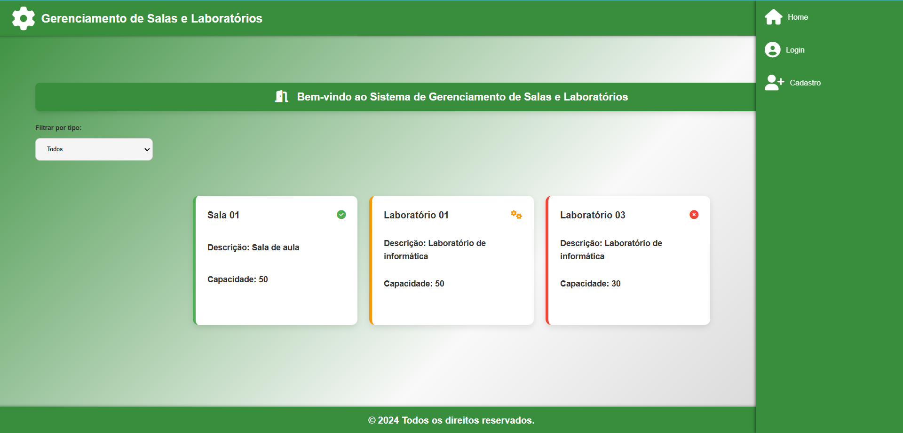
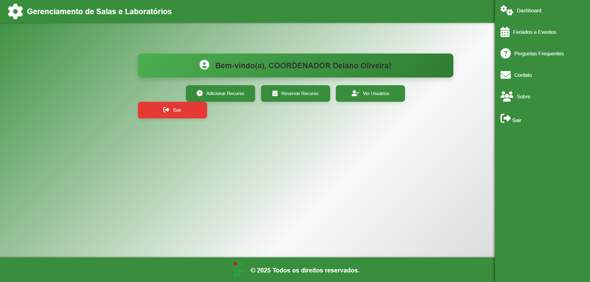

# ResourcesManagement (Gerenciamento de Recursos)

O **ResourcesManagement** é uma aplicação web desenvolvida com **Vue.js** e **Spring Boot** para gerenciar salas, laboratórios e recursos adicionais em uma instituição de ensino. A aplicação oferece funcionalidades específicas para coordenadores, professores e alunos, promovendo uma experiência personalizada baseada no tipo de usuário.

## Visão Geral

### Comportamento do Sistema

A aplicação possui duas formas de interação principais:

1. **Usuário Deslogado**:
   - Página inicial (Home) para visualização de recursos como salas, laboratórios e outros itens.
   - Acesso às páginas:
     - **Início**
     - **Perguntas Frequentes**
     - **Contato**
     - **Sobre**
     - **Login**
     - **Cadastrar**
     - **Esqueceu a senha** (recuperação de conta).

2. **Usuário Logado**:
   - Redirecionado ao **Dashboard**, onde funcionalidades específicas são exibidas com base no tipo de usuário.
   - Acesso às páginas:
     - **Dashboard**
     - **Feriados e Eventos**
     - **Sair** (logout).

### Permissões por Tipo de Usuário

- **Coordenador**:
  - Acesso a todas as funcionalidades, incluindo adição, edição e remoção de recursos.
  - Realização de reservas.
- **Professor**:
  - Pode visualizar e realizar reservas de salas ou laboratórios.
  - Não pode adicionar, editar ou remover recursos.
- **Aluno**:
  - Pode visualizar recursos.
  - Solicitar reservas de salas ou laboratórios (aguardando aprovação de um coordenador).
- **Usuário Deslogado**:
  - Visualização limitada de recursos.

## Funcionalidades

- **Login e Cadastro**: Sistema de autenticação com tipos de usuários definidos.
- **Visualização de Recursos**: Lista de salas, laboratórios e outros itens disponíveis.
- **Gerenciamento de Recursos** (somente coordenadores):
  - Adição, edição e exclusão de salas e laboratórios.
- **Reservas**:
  - Coordenadores e professores podem realizar reservas diretamente.
  - Alunos podem solicitar reservas, sujeitas a aprovação.
- **Recuperação de Senha**: Opção para redefinir senha ao informar e-mail cadastrado.

## Exemplos de Páginas

### Página Inicial (Usuário Deslogado)



A página inicial exibe recursos disponíveis para visualização e opções como **Login**, **Cadastrar**, **Perguntas Frequentes** e **Sobre**.

### Dashboard (Usuário Logado)



Após o login, funcionalidades específicas baseadas no tipo de usuário são exibidas, como:
- Gerenciamento de recursos (coordenador).
- Realização de reservas (coordenador e professor).
- Solicitação de reservas (aluno).

## Configuração do Projeto

### Frontend

1. Clone o repositório do frontend:
   ```bash
   git clone https://github.com/rma98/resourcesManagement.git
   ```
2. Acesse o diretório do frontend:
   ```bash
   cd gerenciamentoSalasFrontend
   ```
3. Instale as dependências:
   ```bash
   npm install
   ```
4. Inicie o servidor de desenvolvimento:
   ```bash
   npm run serve
   ```

### Backend

1. Clone o repositório do backend:
   ```bash
   git clone https://github.com/rma98/backend.git
   ```
2. Acesse o diretório do backend:
   ```bash
   cd gerenciamentoSalasBackend
   ```
3. Execute o projeto com Maven:
   ```bash
   ./mvnw spring-boot:run
   ```

## Estrutura de Diretórios

```
/resourcesManagement
|-- /gerenciamentoSalas
|   |-- /src
|   |   |-- /components
|   |   |-- /views
|   |   |-- /assets
|   |-- /public
|   |-- package.json
|-- /backend
|   |-- /src
|   |   |-- /main
|   |   |   |-- /java
|   |   |   |-- /resources
|   |-- pom.xml
|-- README.md
```

## Contribuição

1. Faça um fork do repositório.
2. Crie uma branch para sua feature:
   ```bash
   git checkout -b minha-feature
   ```
3. Faça suas alterações e teste.
4. Commit suas alterações:
   ```bash
   git add .
   git commit -m "feat: adicionar nova funcionalidade"
   ```
5. Faça push para sua branch:
   ```bash
   git push origin minha-feature
   ```
6. Abra um Pull Request.

## Licença

Este projeto está licenciado sob a Licença MIT. Ele visa facilitar o gerenciamento de recursos em instituições de ensino, promovendo uma experiência organizada e segura para os usuários.
