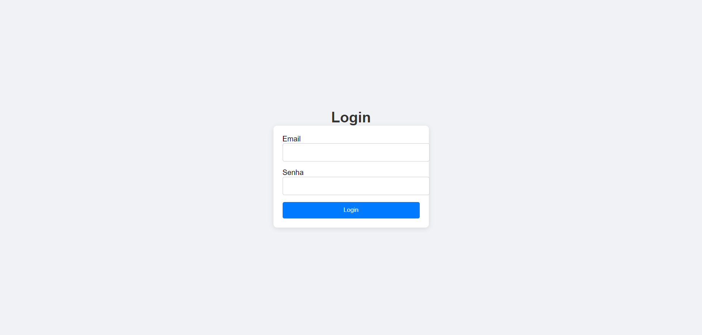
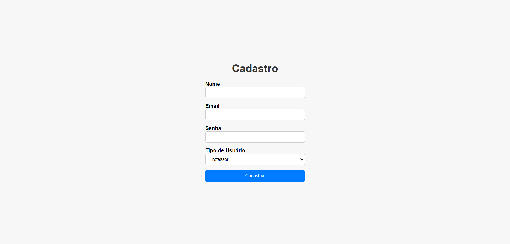
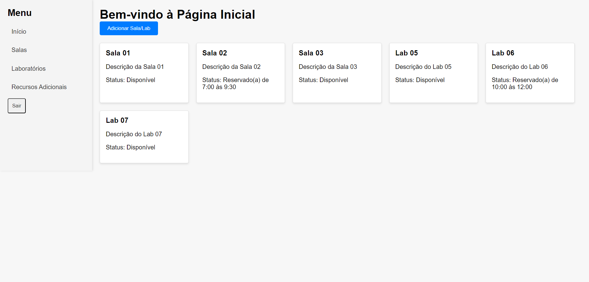
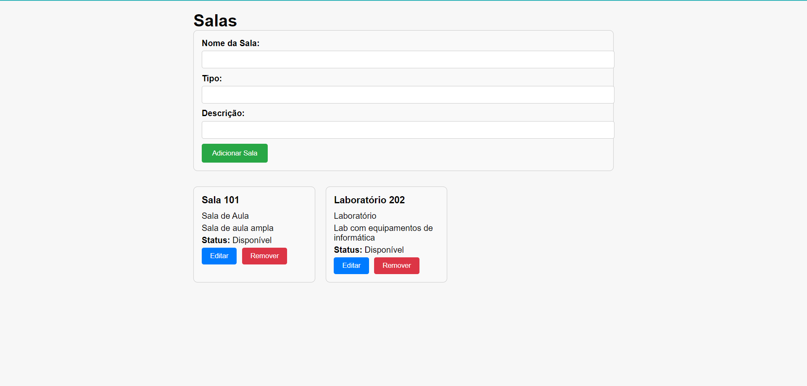
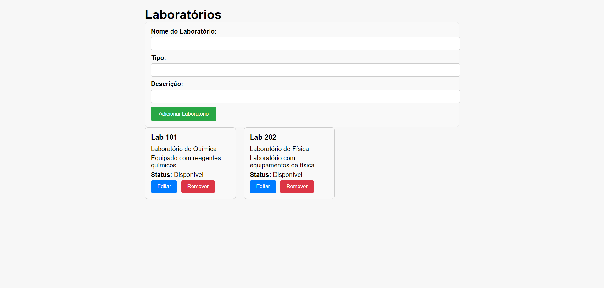
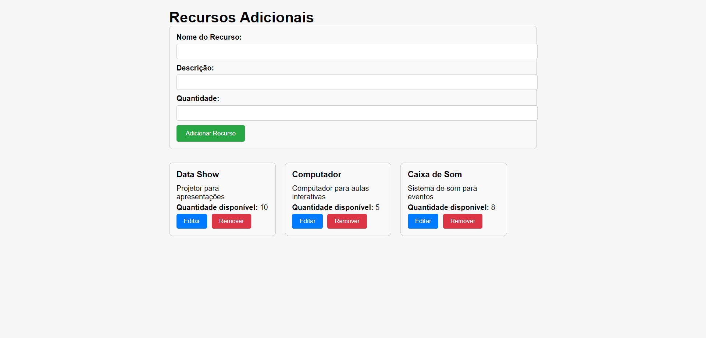

# Projeto Gerenciamento de Salas e Laboratórios

O projeto **Gerenciamento de Salas e Laboratórios** é uma aplicação web desenvolvida com Vue.js e Spring Boot para gerenciar salas e laboratórios em uma instituição de ensino. A aplicação permite o cadastro, visualização, edição e remoção de salas, laboratórios e recursos adicionais, bem como o gerenciamento de reservas.

## Funcionalidades

- **Login e Cadastro**: Acesso seguro à aplicação com diferentes tipos de usuários.
- **Home**: Visualização de salas e laboratórios.
- **Adicionar Salas e Laboratórios**: Inclusão de novas salas e laboratórios no sistema.
- **Recursos Adicionais**: Gerenciamento de recursos que podem ser alocados em salas e laboratórios.
- **Salas e Laboratórios**: Visualização, edição e remoção de salas e laboratórios.

## Tela de Login



A página de login permite que os usuários se autentiquem no sistema.

## Tela de Cadastro



A página de cadastro permite adicionar novos usuários ao sistema.

## Página Inicial



A página inicial exibe uma lista de salas e laboratórios com seus respectivos status.

## Adicionar Salas e Laboratórios





Aqui você pode adicionar novas salas e laboratórios ao sistema.

## Recursos Adicionais



Gerencie recursos adicionais disponíveis para as salas e laboratórios.

## Como Rodar o Projeto

### Requisitos

- Node.js
- npm
- Java JDK
- Spring Boot

### Configuração do Frontend

1. Navegue até o diretório do frontend:
   ```bash
   cd gerenciamentoSalasFrontend
2. Instale as dependências:
   ```bash
   npm install

### Configuração do Backend

1. Navegue até o diretório do backend:
   ```bash
   cd gerenciamentoSalasBackend
2. Execute o projeto com Maven:
   ```bash
   ./mvnw spring-boot:run

### Estrutura de Diretórios

/gerenciamentoSalas
|-- /gerenciamentoSalasFrontend
|   |-- /src
|   |   |-- /components
|   |   |-- /views
|   |   |-- /assets
|   |-- /public
|   |-- package.json
|-- /gerenciamentoSalasBackend
|   |-- /src
|   |   |-- /main
|   |   |   |-- /java
|   |   |   |-- /resources
|   |-- pom.xml
|-- README.md

### Contribuição

1. Faça um fork do repositório.
2. Crie uma branch para sua feature:
   ```bash
   ./mvnw spring-boot:run
3. Faça suas alterações e teste.
4. Commit suas alterações:
   ```bash
   git add .
   git commit -m "feat: adicionar nova funcionalidade"
5. Faça push para sua branch:
   ```bash
   git push origin minha-feature
6. Abra um Pull Request.

### Licença

Este projeto está licenciado sob a Licença MIT.